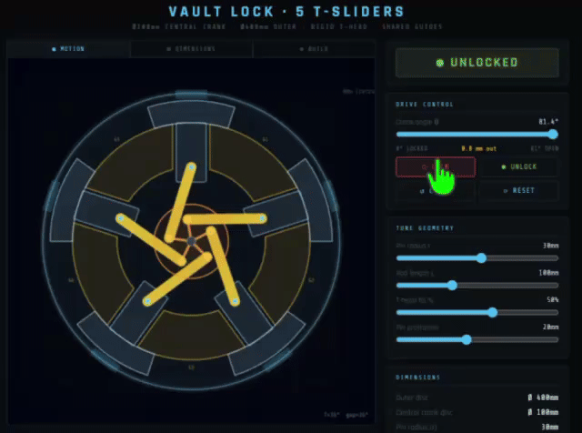
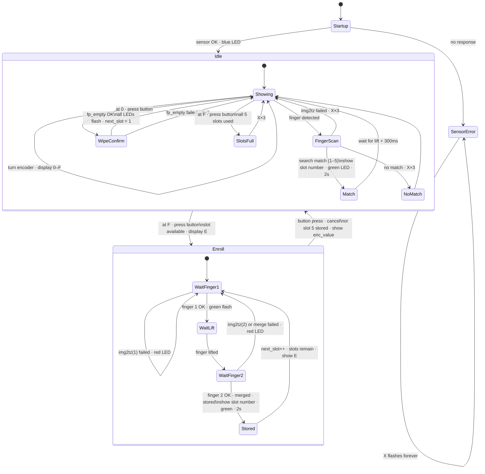
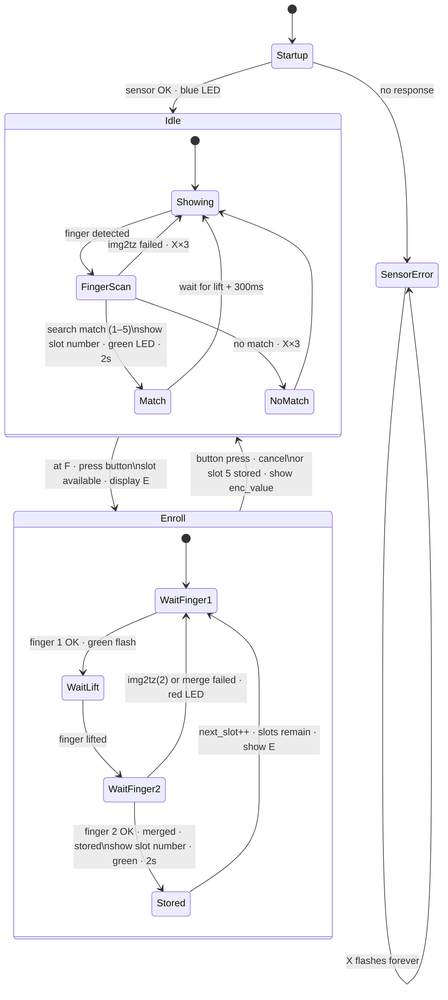

# Work Log

## TODO Links

- [ ] https://forum.arduino.cc/t/using-arduino-to-generate-quadrature-signals-for-sdr/212059/6
- [ ] https://github.com/merbanan/rtl_433/blob/master/docs/BUILDING.md
- [ ] https://www.crowdsupply.com/lime-micro/limesdr
- [ ] https://www.crowdsupply.com/lime-micro/limesdr-mini
- [ ] https://github.com/pothosware/SoapySDR/
- [ ] https://github.com/osmocom/rtl-sdr/
- [ ] https://forum.arduino.cc/t/using-arduino-to-generate-quadrature-signals-for-sdr/212059/5
- [ ] https://hackaday.com/2023/01/13/arduino-library-brings-rtl_433-to-the-esp32/#:~:text=If%20you%20have%20an%20RTL,as%20much%20of%20a%20surprise.
- [ ] The new Elektor SDR Shield for Arduino – Travelling the waves Elektor TV
  - https://www.youtube.com/watch?v=KHdqskbfFhA&t=14s
- [ ] New LoRa 32 V4 ESP32 SX1262 Low Power Dev-Board 0.96inch
      OLED Supports Wi-Fi BLE LoRa communication Compatible Meshtastic
  - https://www.aliexpress.com/item/1005010203038481.html
- [ ] Scanning ESP32 Radar Tracks Multiple Targets in Real Time! - Circuit Helper
  - https://www.youtube.com/watch?v=ZnkWKowQYXg
- [ ] I made Esp32 based Radar : It has a Built-In Display - Dsn Industries
  - https://www.youtube.com/watch?v=t4QVxeeEtEQ

- [ ] official docs
  - https://www.analog.com/en/products/max32630.html#documentation
  - downloaded the data sheet
  - also
    - https://www.analog.com/media/en/reference-design-documentation/design-notes/ds147-take-a-weight-off-your-chest-with-a-wrist-worn-ecg-monitor.pdf
    - https://www.analog.com/en/resources/design-notes/how-to-create-a-remote-medical-sensing-system-using-maxim-integrateds-iot-development-platform.html
    - https://www.analog.com/en/resources/technical-articles/take-a-weight-off-your-chest-with-a-wristworn-ecg-monitor.html
    - https://www.analog.com/media/en/technical-documentation/user-guides/interface-guide-for-max32664-sensor-hubbased-reference-design-platforms.pdf
    - https://www.analog.com/media/en/technical-documentation/user-guides/max32630-users-guide.pdf

- another competition from 2017
- [ ] https://www.allaboutcircuits.com/giveaways/get-creative-makewithmaxim-design-contest/
  - https://forum.allaboutcircuits.com/ubs/makewithmaxim-vr-glove.970/
  - https://forum.allaboutcircuits.com/ubs/pelvic-sensor.968/
  - https://forum.allaboutcircuits.com/ubs/makewithmaxim-maxbot-a-low-cost-robotic-kit.975/
  - https://forum.allaboutcircuits.com/ubs/max32630fthr-as-a-vr-controller-makewithmaxim.966/
  - https://forum.allaboutcircuits.com/ubs/fitness-wearable.980/
  - https://forum.allaboutcircuits.com/ubs/hygromax-630-made-with-maxim-final-submission.989/
  - https://forum.allaboutcircuits.com/ubs/impact-sensor.979/
  - https://forum.allaboutcircuits.com/ubs/autonomous-quadcopter.987/
  - https://forum.allaboutcircuits.com/ubs/makewithmaxim-sciencesensorhub.988/
  - https://forum.allaboutcircuits.com/ubs/max32630fthr-wearable-ekg.990/
  - https://forum.allaboutcircuits.com/ubs/makewithmaxim-model-rocket-data-acquisition-and-telemetry.976/

- [ ] Digikey schematics
  - https://www.digikey.com/en/schemeit/project/max32630fthr-pegasus-board-TS7G7N03027G

---

## Sat 16 May 2026

Given the below `FF00` channel seems not to work, added the `FF01` implemented
feature which allows for LED turn on/off and that works

**NEXT:** probably to add other features to that and some more functionality but
in a new real ./src builld for the project

## Fri 15 May 2026

attempting to move forward with the final frontend configuration


Plan: SentinelBox Console Web App
TL;DR: Build sentinel-console/ at the project root as a Vite + React +
shadcn/ui single-page app. The key tension is that shadcn/ui is React-first
while web components are framework-agnostic — the solution is to use Lit
(Google's 5KB web components library) for two specific pieces: the BLE hardware
abstraction layer and the debug terminal. Lit components plug natively into
React. You get real web components education and real shadcn/ui usage.

### Steps

#### Phase 1 — Scaffold

1. Create sentinel-console/ at the project root with Vite + React + TypeScript
   template
1. Add Tailwind CSS via @tailwindcss/vite plugin
1. Run shadcn@latest init — sets up components.json, aliases, base CSS
   variables
1. Run pnpm add lit — Lit is the standard web components framework (~5KB), no
   extra build config needed
1. Add shadcn/ui components via CLI: button card tabs badge progress input
   select switch separator alert slider scroll-area

#### Phase 2 — BLE Web Component + Hook

1. src/ble/gatt.ts — UUID constants (0xF001–0xF014), command byte enums, a
   typed BleCharacteristic helper (read/write/subscribe with ArrayBuffer ↔
   typed value conversions)
1. src/ble/SentinelBleManager.ts (Lit LitElement, registered as
   <sentinel-ble-manager>) — encapsulates all Web Bluetooth API calls; fires
   custom events: sentinel-connected, sentinel-disconnected,
   sentinel-state-change, sentinel-gatt-notify; exposes methods: connect(),
   disconnect(), readCharacteristic(uuid), writeCharacteristic(uuid, value).
   This is the genuine web component.
1. src/ble/useSentinelBle.ts — React hook that holds a ref to the
   <sentinel-ble-manager> element, listens to its custom events via
   addEventListener, and returns typed state + command functions to the rest of
   the React tree
1. src/ble/config-codec.ts — encodeConfig(cfg) → Uint8Array and
   decodeConfig(buf) → typed object, matching the 100-byte INFO flash layout
   from README; crc16ccitt() pure function
1. Mount <sentinel-ble-manager> once in App.tsx; wrap with a BleContext
   provider

#### Phase 3 — App Shell

1. src/App.tsx — persistent header ("SentinelBox Console", connection Badge,
   device name) + shadcn Tabs with three tabs: Connect, Setup, Debug
1. Tabs are disabled when not connected (except Connect)

#### Phase 4 — Connect Tab

1. ConnectionPanel.tsx — "Pair Device" Button (shows Loader2 spinner while
   scanning); once connected shows "Disconnect" danger button. Reads 0xF001 on
   connect to seed initial state.
1. DeviceStateCard.tsx — Card showing current firmware state name, matching LED
   colour dot (CSS colour from state enum), and state description; updates live
   from sentinel-state-change events

HERE I ran into some problems, cannot seem to set the new service at FF00

and also cannot seem to easily disconnect or forge the device in chrome?

- chrome://bluetooth-internals/#devices find devices and GATT
- chrome://device-log/ a log of things like bluetooth
- chrome://flags/#enable-web-bluetooth-new-permissions-backend
  - Use the new permissions backend for Web Bluetooth changed from DEFAULT to
    ENABLED and that seems it allows me to disconnect but is more strict so
    changed back

#### Phase 5 — Setup Tab (Wizard)

1. SetupWizard.tsx — shadcn Progress bar (4 steps), step router; validates at
   each step before allowing advance; "Back" / "Next" navigation
1. VaultCalibrationStep.tsx (Step 1) — large step-count display; sends
   CMD_SETUP_VAULT to 0xF010 on enter; four Buttons: −100 / −10 / +10 / +100
   each write updated value to 0xF011; "Test Return" drives motor home;
   "Confirm" advances wizard
1. FingerprintStep.tsx (Step 2) — 10-slot grid; each slot: slot badge, 8-char
   Input for name, Switch for Adult/Child role, "Enrol" Button; enrolment
   drives a 3-step scan sequence (polling 0xF001), showing SCAN → LIFT → SCAN →
   OK/RETRY feedback inline; slot status badge (empty / enrolled / failed);
   requires ≥ 1 Adult to advance
1. PolicyStep.tsx (Step 3) — Select for unlock policy (Any / 1 Adult / 1
   Adult+1 Child / 2 Adults); Select for auto-relock (5 min / 10 min / 30 min /
   Never); shows Alert warning if selected policy exceeds enrolled adult count
1. ConfirmStep.tsx (Step 4) — summary Card showing all values; "Write to
   Device" button encodes config via config-codec.ts, sends to 0xF014; shows
   success/failure Alert; on success transitions device to Armed state

#### Phase 6 — Debug Tab

1. GattExplorer.tsx — expandable list of all 7 characteristics; each shows
   UUID, name, properties; "Read" button shows current hex + decoded value;
   writable ones show hex Input + "Write" button; 0xF001 has a "Subscribe"
   Switch for live notifications
1. LedOverrideCard.tsx — six colour Buttons (Off / Red / Green / Blue / Cyan /
   White) with coloured dot; writes the matching byte to 0xF002
1. src/components/terminal/SentinelTerminal.ts (Lit LitElement,
   <sentinel-terminal>) — web component #2; shadow DOM with a scrolling
   terminal panel; log(msg, level) method; colour levels: tx (blue) / rx
   (purple) / ok (green) / warn (amber) / error (red) — matches the palette in
   ble_debug.html; max-lines attribute; "Clear" and auto-scroll toggle buttons
   inside shadow DOM
1. SentinelTerminal.tsx — thin React ref wrapper that passes all BLE events
   from useSentinelBle into the web component's log() method

## Thu 14 May 2026

### Back to the official port structure

The first cut of `port/btstack_port.c` was a hand-rolled polling HAL with
a custom `drain_tx()` helper called twice per loop iteration — once before and
once after `btstack_run_loop_embedded_execute_once()`. The rationale was that
ATT responses queued during packet processing needed to be flushed immediately
or Web Bluetooth would time out. It worked, but it was over-engineered:

```c
// OLD: double-drain pattern
drain_tx(uart);       // flush pending TX
drain_rx(uart);       // pull in HCI events
btstack_run_loop_embedded_execute_once();
drain_tx(uart);       // flush responses queued above
```

Looking at the official BTstack port for this board
(`third_party/btstack/port/max32630-fthr/src/btstack_port.c`) it uses the same
cooperative polling approach — **not** interrupt-driven DMA — but with a simpler
single-pass structure: RX drain → TX drain → run loop tick. That's it. The
official port trusts that the next iteration of the tight `while(1)` loop is
fast enough to service TX before any timeout fires, and it is.

Switching to match the official structure also let me:

1. **Enable baud rate renegotiation** — `baudrate_main = 4000000`. The CC256X
   init script includes a baud-change vendor command; BTstack sends it
   automatically when `baudrate_main != 0`. Running at 4 Mbps (vs 115200)
   means HCI packets transfer ~35× faster, which is especially noticeable
   during the ~150-command service pack upload at boot.

2. **Poll HCI RTS for module readiness** — instead of a blind 500 ms
   `TMR_Delay` after releasing nSHUTD, the port now spins on P0.3 (the
   CC2564B's RTS output) until it goes low. This matches what the official port
   does and shaves a few hundred milliseconds off boot when the module is
   already warm.

3. **Set `flowcontrol = 1`** in the HCI config struct — tells BTstack that
   hardware CTS/RTS is available. The old code set it to 0 and relied on the
   UART peripheral's CTS gating alone; explicitly declaring it lets BTstack
   skip software flow-control workarounds.

4. **Use `CLKMAN_SCALE_AUTO`** — required for the UART peripheral to derive a
   valid baud divisor at 4 MHz. The old `CLKMAN_SCALE_DIV_1` forced the
   peripheral clock to system clock ÷1 which only works up to ~1 Mbps.

The result is simpler code (no `drain_tx` helper, no debug-logging in the HAL
layer) that matches the reference implementation and runs faster.

### From Raw HCI to BTstack — a Proper BLE Stack

Yesterday's `experiments/in_bluetooth` got advertising working by hand-rolling
every HCI command — manually uploading the CC256XB service pack, constructing
advertising payloads byte-by-byte, and polling the UART for event responses.
That's fine for "does it transmit?", but it can't do anything useful: no GATT
server, no connection handling, no ATT database. A phone can see "SentinelBox"
in its scan list but can never read or write a characteristic.

Today's `experiments/in_btstack` replaces all of that with
[BTstack](https://github.com/bluekitchen/btstack) — a lightweight, portable
Bluetooth stack that handles HCI, L2CAP, ATT, SM and GATT properly.

#### Third-party library: BTstack as a git submodule

```sh
git submodule add https://github.com/bluekitchen/btstack.git third_party/btstack
```

BTstack is ~300 source files but only ~20 are needed for a BLE-only GATT
server. The Makefile lists each one explicitly — no wildcard magic:

```makefile
BTSTACK_SRCS := \
    btstack_memory.c btstack_linked_list.c \
    hci.c hci_cmd.c hci_transport_h4.c \
    l2cap.c l2cap_signaling.c \
    att_db.c att_dispatch.c att_server.c \
    sm.c le_device_db_memory.c \
    btstack_chipset_cc256x.c \
    btstack_uart_block_embedded.c
```

#### Differences from @arvindsa's approach

Fellow challenger @arvindsa documented their BTstack bring-up in [Identity
Protocol - Part 4 - BLE using PAN1326B and BTstack](https://community.element14.com/challenges-projects/design-challenges/smart-security-and-surveillance/f/forum/56853/identity-protocol---part-4---ble-using-pan1326b-and-btstack).
Key differences in my implementation:

| Their approach                                                 | Mine  |
|----------------------------------------------------------------|---------------------------------------------------------------|
| Used BTstack's bundled LPSDK copy in `port/max32630-fthr/maxim/` | Use system LPSDK at `~/Maxim/Firmware` — smaller checkout     |
| Used BTstack's own `main.c` + `btstack_port.c` from the port directory | Wrote a custom `port/btstack_port.c` with a polling HAL — no interrupts, explicit `drain_tx`/`drain_rx` in the main loop |
| Needed `-DENABLE_HCI_INIT` flag (unclear why)                  | Not needed — `bluetooth_main()` calls `hci_init()` directly   |
| Needed a `btstack_link_key_db_stub.c` linker shim              | Not needed — only BLE sources compiled, no classic references |
| Beacon-only (advertising, no GATT)                             | Full GATT server with LED control characteristic              |

#### The GATT database — `.gatt` → `.h`

BTstack has a Python tool that compiles a human-readable `.gatt` file into a C
byte array. The service definition is trivial:

```
PRIMARY_SERVICE, 0000F001-0000-1000-8000-00805F9B34FB
    CHARACTERISTIC, 0000F002-..., DYNAMIC | WRITE | WRITE_WITHOUT_RESPONSE,
```

Compiled with:

```sh
python3 third_party/btstack/tool/compile_gatt.py \
    led_service.gatt led_service.h
```

#### The `l2cap_init()` bug

Connection worked (LED turned blue) but Chrome's Web Bluetooth page hung at
"Reading services…" — no GATT responses ever came back. The issue:
`l2cap_init()` was missing from `btstack_main()`. L2CAP is the multiplexing
layer between HCI and ATT. Without it, incoming ATT requests on CID 0x0004 are
Every BTstack example calls it before `sm_init()`:

```c
l2cap_init();
sm_init();
att_server_init(profile_data, NULL, att_write_handler);
```

#### Custom polling HAL

Unlike the official BTstack port which uses interrupts and DMA, this
implementation polls UART0 directly in the main loop. The key insight was
needing a **second TX drain** after `btstack_run_loop_embedded_execute_once()`
— without it, ATT responses queued during packet processing wait an entire
extra loop iteration, breaking Web Bluetooth's tight timing expectations.

#### Web Bluetooth debugger

A `ble_debug.html` page served from localhost uses the Web Bluetooth API to
scan, connect, browse services, read/write characteristics, and subscribe to
notifications — all from Chrome with zero native code. After the `l2cap_init()`
fix, it successfully discovers the LED service and writes `01`/`02`/`03` to
toggle the RGB LED remotely.

## Wed 13 May 2026

### Bluetooth on the MAX32630FTHR — More Wiring Than You Think

The board has a **PAN1326B** Bluetooth module soldered directly on it — no
external module or extra wiring needed. Inside the PAN1326B is a **TI CC2564B**
dual-mode BT/BLE chip. It talks to the MAX32630 via UART0, but getting it to
respond involved several non-obvious steps.

#### Mapping B — the crossover surprise

UART0 on the MAX32630 has two pin mappings. On the FTHR board, the PAN1326B is
wired so that P0.0 is the MCU's _receive_ pin and P0.1 is _transmit_ — the
opposite of the UART0 default (Mapping A). Selecting **Mapping B** in the IOMAN
configuration crossovers them automatically. Nothing in the Arduino world would
surface this because `Serial0.begin()` just works — in bare-metal LPSDK you have
to know to ask for it:

```c
const sys_cfg_uart_t ble_sys = {
    .clk_scale = CLKMAN_SCALE_DIV_1,
    .io_cfg    = IOMAN_UART(0, IOMAN_MAP_B, IOMAN_MAP_A, IOMAN_MAP_A, 1, 0, 0),
};
UART_Init(MXC_UART0, &ble_cfg, &ble_sys);
while (MXC_IOMAN->uart0_ack != MXC_IOMAN->uart0_req) {}
```

#### The 1.8V pins

All P0 and P1 pins connected to the BLE module run at **1.8V** VDDIO, not the
3.3V VDDIOH rail used elsewhere on the board. In LPSDK, pins default to 1.8V
unless you set bits in `use_vddioh_0/1`. So the right move is to confirm those
bits are clear — 3.3V on a 1.8V input is a reliable way to get no response.

#### Three steps to get 32kHz out of P1.7

The BLE module needs a 32.768 kHz reference clock on P1.7. Enabling just the
output bit (`PWR_PSEQ_32K_EN`) isn't enough — the crystal oscillator itself also
needs to be started first:

```c
MXC_RTCCFG->clk_ctrl |= MXC_F_RTC_CLK_CTRL_NANO_EN;
MXC_RTCCFG->osc_ctrl |= MXC_F_RTC_OSC_CTRL_OSC_WARMUP_ENABLE;
MXC_PWRSEQ->reg4     |= MXC_F_PWRSEQ_REG4_PWR_PSEQ_32K_EN;
TMR_Delay(MXC_TMR0, MSEC(50));
```

Skipping the first two lines gives you a valid GPIO voltage on P1.7 — just no
clock signal. The module boots but never initialises its HCI UART properly.

#### The CTS trap

With hardware flow control enabled (`.cts = 1` in `uart_cfg_t`), the UART
peripheral refuses to transmit while the CTS input (P0.2) is HIGH. During boot,
the PAN1326B holds its RTS output HIGH — which feeds directly into P0.2. Result:
every HCI command sits in the transmit buffer and never goes out. The fix is to
**disable hardware CTS checking** and let the MCU transmit freely:

```c
const uart_cfg_t ble_cfg = {
    .parity = UART_PARITY_DISABLE, .size = UART_DATA_SIZE_8_BITS,
    .extra_stop = 0, .cts = 0, .rts = 0, .baud = 115200,
};
```

The Arduino reference implementations quietly avoid this by never enabling
hardware flow control in `HardwareSerial::begin()`. In LPSDK you get to discover
it the hard way.

#### The CC256XB service pack — LE needs firmware

The CC2564B chip ships without any LE (Bluetooth Low Energy) subsystem firmware.
After a plain HCI Reset, standard BLE commands like
`HCI_LE_Set_Advertising_Parameters` (opcode `0x2006`) come back as "Unknown HCI
Command". Before BLE works, a **service pack** of ~150 TI vendor-specific HCI
commands must be uploaded.

TI distributes this as `CC256XB-BT-SP`. The Bluetopia variant (`CC256XB.h`)
packages all the commands as two C arrays — `BasePatch[]` and `LowEnergyPatch[]`
— each a flat stream of raw HCI packets. Uploading is straightforward iteration:

```c
while (p + 4 <= end) {
    unsigned int cmd_len = 4 + p[3];
    hci_send(p, cmd_len);
    hci_drain_event(200);
    p += cmd_len;
}
```

The last command in `LowEnergyPatch` is `0xFD5B` (LE enable). It takes
noticeably longer than the others and its Command Complete event can still be
sitting in the UART buffer when you send the follow-up HCI Reset. The symptom:
`hci_reset()` receives `04 0E 04 01 5B FD 00` — a valid response, but for the
wrong command. The fix is to loop in `hci_reset()` and skip any Command Complete
that isn't for the Reset opcode `0x0C03`.

The file is TI proprietary (TSPA licence) so it lives in
`reference/CC256XB_BT_SP/` which is gitignored. The Makefile adds it to `IPATH`
and gives a clear error with the TI download URL if it's missing:

```makefile
CC256XB_DIR := $(abspath $(dir $(lastword $(MAKEFILE_LIST)))/../../reference/CC256XB_BT_SP/v1.8/Bluetopia)
ifeq ($(wildcard $(CC256XB_DIR)/CC256XB.h),)
  $(error CC256XB.h not found -- download TI CC256XB-BT-SP)
endif
```

#### Serial debug via DAPLink — no extra hardware

The CMSIS-DAP USB connection used for flashing with OpenOCD exposes **two** USB
interfaces: the HID interface for the debugger, and a **CDC virtual COM port**
bridged to UART1 (P2.0/P2.1) on the MAX32630. So the same USB cable you flash
with is also your serial console:

```sh
screen /dev/tty.usbmodem* 115200
```

Adding `UART_Init(MXC_UART1, ...)` and a handful of `UART_Write()` calls gives
printf-style debug output with zero extra hardware. This turned a blind "is it
transmitting?" situation into a clear trace of every HCI command and response
byte:

```
[HCI TX] 01 03 0C 00
[HCI RX] 04 0E 04 01 03 0C 00
[HCI] reset OK
[CC256X] uploading patch...
```

A `mise run serial` task auto-finds the port and opens `screen`.

#### Chrome Web Bluetooth scanner

Chrome (and Edge) support the **Web Bluetooth API** — a page served from
`localhost` can scan for and connect to nearby BLE peripherals without any
native app. The device picker shows all advertising BLE devices:

```js
const device = await navigator.bluetooth.requestDevice({
  acceptAllDevices: true,
  optionalServices: ["generic_access"],
});
const server = await device.gatt.connect();
const services = await server.getPrimaryServices();
```

A small `ble_debug.html` in the experiment directory acts as both a "does it
advertise?" check (SentinelBox lights up in the device list) and a full GATT
browser once connected — listing services, characteristics, and their values.
Serve it with `mise run ble-debug` (`python3 -m http.server 8080`) since Web
Bluetooth requires a secure context and won't run from `file://`.

Once the firmware reaches the green-blink state, SentinelBox is visible to any
phone or Chrome tab in range — the first step toward a phone-based configuration
interface for the lock box.

## Mon 11 May 2026

- got the stepper motor working

- played around with a vault door design



## Fri 1 May 2026

### Uart comms

A comment came up on my last post about UART comms. [Sentinel Box - Part II - back to C](https://community.element14.com/challenges-projects/design-challenges/smart-security-and-surveillance/f/forum/56894/sentinel-box---part-ii---back-to-c)

presumably in regards to @skruglewicz design

[Forum #5: Proposed Design — Adaptive Sentinel: Security & Environmental Intelligence Hub](https://community.element14.com/challenges-projects/design-challenges/smart-security-and-surveillance/f/forum/56892/forum-5-proposed-design-adaptive-sentinel-security-environmental-intelligence-hub)

having a MAX32630FTHR talk UART to a UNO Q
and another MAX32630FTHR talk UART to the same UNO Q

UART should work:

- with same voltage either 3V3 or 5V otherwise you will need a lievel shifter
- RX on one board has to go across to TX on the other board
- they need a shared GND

Baud rates

- < 1m 115200+ should be ok
- ~3m 115200 is the limit
- ~10m 9600-57600 would start seeing errors
- > 10m move to something like RS-323 or RS-485

UART is fine for 2 boards on a desk

Other alternatives are

- CAN bus
  - 128 (CAN) nodes or unlimited with CAN FD
  - 500m @125kbps or 40m @1Mbps
  - CRC + ACK + error frames
  - 2 wires twisted pair + GND
  - needs MCP2515 or similar chip
  - needs 120Ω termination resistors to prevent reflection corrupting the signal
- I2C
  - can have up to 127 devices
  - short distances <1m
  - Master/Slave topology fits
  - may need pull-up resistors 4.7kΩ at 100kHz
  - SDA/SCL share bus so needs collision management
- RS-485
  - can have 32 nodes
  - cheap MAX485 or SP3485 chips
  - still UART underneath
  - 100m+ at 100kbps
  - differential signaling means it is noise immune

there is also: LIN Bus, Modbus, EtherCAT, 1-Wire, SPI

TO acutally get UART working you have 3 approaches:

1. Request/Response - one device is mater and sends requests and then listens - simple and predictable
2. Turn-taking with a token/flag byte
3. Asychronous/event-driven - dependent on UART being full-duplex - but you need start/end framing markers and buffering so you can assemble complete messages from the stream

## Thu 30 Apr 2026

After a bunch of misstarts with trying to get the 96 MHz frequency set on the
MAX32630FTHR board in rust, I gave up and switched back to C and LPSDK which
just works. A rotary encoder and a finger print reader via UART and I have a way
of encoding and recognising a bunch of finger prints, this is going to initially
unblock me to get something built.



maybe this can be simplified a bit



## Wed 24 Apr 2026

### experiments in attitude meter 🛩️ 🧭

<video width="740" controls>
  <source src="./docs/assets/20260423_01_attitude_meter.mp4" type="video/mp4">
  Your browser does not support the video tag.
</video>

Made a reasonable LED matrix "artificial horizon" with scrolling velocity
feedback using the onboard `BMI160` intertial measurement unit and an external
LED matrix display powered by a MAX7219 serial display driver.

The core logic is in the [./experiments/in_attitude_meter/src/main.rs](./experiments/in_attitude_meter/src/main.rs) file.

```rust
    loop {
        // Get the X and Y acceleration
        let ax = bmi160::read_accel_x();
        let ay = bmi160::read_accel_y();

        // ay drives velocity: tilt makes bar scroll, urging user to counter-tilt
        // 2^15 = 32,768
        // Sensitivity = 16384 LSB/g (1g = 16384 counts)
        // by ay / 32768.0 we normalizes to ±1.0 where ±1.0 = ±2g (full scale).
        let velocity = -(ay as f32) / 32768.0;
        let next = bar_pos + velocity;
        let r = next % 8.0;
        bar_pos = if r < 0.0 { r + 8.0 } else { r };

        // ax tilts the bar diagonally: ±3.5 rows across 8 columns at max tilt
        let slope = (ax as f32) / 32768.0 * 3.5;

        let mut rows = [0u8; 8];
        for col in 0..8u32 {
            let col_pos = bar_pos + slope * (col as f32 - 3.5);
            let r = col_pos % 8.0;
            let wrapped = if r < 0.0 { r + 8.0 } else { r };
            let row = ((wrapped + 0.5) as usize) % 8;
            rows[row] |= 1 << col;
        }

        display.clear();
        for (i, &mask) in rows.iter().enumerate() {
            if mask != 0 {
                display.write_reg((i + 1) as u8, mask);
            }
        }

        // Refresh every ~10ms assuming 96 Mhz clock
        asm::delay(960_000); // ~10 ms
    }
```

based on the BMI160 data sheet

- [https://www.bosch-sensortec.com/media/boschsensortec/downloads/datasheets/bst-bmi160-ds000.pdf](https://www.bosch-sensortec.com/media/boschsensortec/downloads/datasheets/bst-bmi160-ds000.pdf)

1. Two I2C transactions per frame (easy fix)
   read_accel_x() does a 2-byte read, read_accel_y() does a separate 6-byte read —
   two transactions. read_accel_y() already reads all 6 bytes and discards X and
   Z. One function reading all 6 at once and returning a struct would halve your
   I2C traffic.

2. Z axis — already in your buffer, thrown away
   The 6 bytes at REG_ACC_X_LSB give X, Y, Z in order. buf[4..5] = Z (vertical
   when flat). Z lets you detect if the board is nearly flat vs steeply tilted,
   and x²+y²+z² ≈ 16384² is a vibration/free-fall check.

3. Gyroscope — completely unused
   The chip has a full 3-axis gyroscope — currently in suspend. Wake it with
   CMD_GYR_NORMAL = 0x15 (startup takes 55 ms). Gyro data is at registers
   0x0C–0x11 (same 6-byte pattern as accel). At default ±2000°/s range,
   sensitivity = 16.4 LSB/°/s.

For the attitude meter this is the biggest win: gyro gives angular rate
(rotation speed in °/s), which doesn't noise-up with vibration. A simple
complementary filter blends them:

angle = 0.98 × (angle + gyro_rate × dt) + 0.02 × accel_angle
This gives stable, smooth tilt — gyro handles fast motion, accel corrects slow
drift.

4. ACC_CONF (0x40) — ODR not set explicitly
   Your loop runs at ~5 ms (200 Hz) but the default accelerometer ODR is 100 Hz
   (acc_odr=8). You're reading stale data half the time. Write 0x29 to ACC_CONF to
   set 200 Hz, or 0x2A for 400 Hz.

5. Fast Offset Compensation — one-shot hardware calibration
   From §2.9.1: a built-in calibration sequence removes mounting bias. With the
   board held flat, write FOC_CONF (0x69) then issue start_foc to the CMD register
   (0x7E). Takes ≤250 ms, then writes trim values into the OFFSET registers
   (0x71–0x77) automatically. The accuracy is 3.9 mg. Can be saved to NVM (≤14
   write cycles lifetime). This would zero out any bias so "level" truly reads
   ax=0, ay=0.

6. Temperature sensor — free when gyro is active
   Registers 0x20–0x21, 16-bit, 0.002°C/LSB, centre at 23°C. No extra init. Useful
   for knowing if thermal drift is affecting readings.

| Priority | Change                                  | Benefit                |
| -------- | --------------------------------------- | ---------------------- |
| 1        | Single burst read for X+Y+Z             | Efficiency + Z axis    |
| 2        | Set ACC_CONF ODR to 200 Hz              | No stale reads         |
| 3        | Enable gyroscope + complementary filter | Smooth stable attitude |
| 4        | FOC calibration at startup              | True zero at level     |

## Wed 23 Apr 2026

### 6 Axis acceleromenter and an attitude meter in Rust 🦀

The 6 Axis acccelerometer inside the MAX32630FTHR can be used for a balance bot

- https://www.hackster.io/justin-jordan/max32630fthr-balance-bot-621f0f

- **MAX32630FTHR Balance Bot - Justin Jordan**

  [](https://youtu.be/Uu7QbEvHTG8)

- **MAX32630FTHR Balance Bot part 2 - Justin Jordan**

  [](https://youtu.be/A3T340ZXMZY)

most of the code has been downloaded into
[./reference/MAX32630FTHR_balance_bot_code](reference/MAX32630FTHR_balance_bot_code)

## Tue 22 Apr 2026

### Cold restart working with Rust 🦀

Two terms that kept coming up:

- **POR** (Power-On Reset) — what happens when power is physically applied to
  the chip. Every register resets to its factory default. Nothing is remembered
  from any previous run.
- **SWD** (Serial Wire Debug) — the two-wire interface (SWDIO + SWDCLK) used
  by OpenOCD and DAPLink to program and debug ARM Cortex-M chips. An SWD reset
  is a software-triggered reset through the debug interface. **Crucially, SWD
  reset is not the same as POR** — many peripheral registers survive an SWD
  reset.

This distinction is exactly why the Rust firmware always worked after
`mise run upload:in_attitude_meter` (which ends with an SWD reset) but failed
on cold restart (POR): the previous mbed or LPSDK run had configured certain
registers, and those values survived the SWD reset but were wiped on POR.

Three things were needed to fix cold boot:

#### 1. `sys::init()` — clock, oscillator trim, flash controller

A new `experiments/in_attitude_meter/src/sys.rs` replicating what the LPSDK
does in `PreInit()` and `SystemInit()` (source:
`~/.platformio/packages/framework-mbed/targets/TARGET_Maxim/TARGET_MAX32630/device/system_max3263x.c`).

The `cortex_m_rt` crate used by Rust does generic ARM Cortex-M startup only —
it copies `.data`, zeroes `.bss`, and calls `main()`. It knows nothing about
the MAX32630's chip-specific initialisation. Three things go wrong after a POR
without it:

- **Clock source** — `CLKMAN_CLK_CTRL = 0x1` at `0x4000_0404` explicitly
  selects the 96 MHz ring oscillator. Without it the chip may run at half speed
  or an undefined frequency. (`PreInit()` in the LPSDK.)

- **Oscillator trim** — factory calibration values live in the device INFO
  block at `TRIM_PWR_REG5/6` (`0x4000_1034` / `0x4000_1038`). They must be
  copied to the power sequencer at `PWRSEQ_REG5/6` (`0x4000_0814` /
  `0x4000_0818`) on every POR, because those registers lose state on a full
  power cycle but survive an SWD reset. Without the correct trim the 96 MHz
  oscillator is uncalibrated and unstable — I2C and delay timing become
  unreliable. (`SystemInit()` in the LPSDK.)

- **Flash `AUTO_CLKDIV`** — `FLC_PERFORM |= 0x3701_0000` at `0x4000_2050`
  lets the flash controller derive its own clock divider automatically.
  OpenOCD configures this during programming (which is why warm restart always
  worked), but it resets on POR. (`SystemInit()` in the LPSDK.)

```rust
// sys.rs — called as the very first line of main()
unsafe fn sys_init() {
    CLKMAN_CLK_CTRL.write_volatile(0x0000_0001);          // 96 MHz RO
    // copy trim from INFO block → PWRSEQ (oscillator calibration)
    let trim5 = TRIM_PWR_REG5.read_volatile();
    let trim6 = TRIM_PWR_REG6.read_volatile();
    if (FLC_CTRL.read_volatile() & (1 << 25)) != 0
        && trim5 != 0xFFFF_FFFF && trim6 != 0xFFFF_FFFF
    {
        PWRSEQ_REG5.write_volatile(trim5);
        PWRSEQ_REG6.write_volatile(trim6);
    } else {
        let r6 = PWRSEQ_REG6.read_volatile();
        PWRSEQ_REG6.write_volatile((r6 & !0x01FF_0000) | (0x1E0 << 16));
    }
    let p = FLC_PERFORM.read_volatile();
    FLC_PERFORM.write_volatile(p | 0x3701_0000);          // AUTO_CLKDIV etc.
}
```

#### 2. `pmic.rs` — enable LDO3 as well as LDO2

The original mbed reference (`low_level_init.c`) only writes LDO2 because
that's the minimum needed for the MCU to run. LDO3 powers the expansion header
3V3 rail — the MAX7219 is wired there. The LPSDK `Board_Init` writes both (see
`experiments/in_blink_LPSDK/main.c`).

```rust
pmic_write(0x15, LDO_3300MV);  // LDO2_VSET — core supply
pmic_write(0x14, LDO_ENABLED); // LDO2_CFG
pmic_write(0x17, LDO_3300MV);  // LDO3_VSET — 3V3 header rail
pmic_write(0x16, LDO_ENABLED); // LDO3_CFG
```

No delay between LDO2 and LDO3 is needed (tested and confirmed).

#### 3. 100 ms delay after `pmic::init()` before touching the MAX7219

LDO3 comes up inside `pmic::init()` on cold boot. The MAX7219 needs to
complete its own internal power-on reset sequence before it will accept SPI
commands. On warm restart LDO3 was already on, so the chip was already up and
this made no difference. On cold boot, hitting the MAX7219 immediately after
`pmic::init()` returns meant the init commands were silently ignored and the
chip stayed in shutdown.

```rust
sys::init();
pmic::init();
cortex_m::asm::delay(9_600_000); // ~100 ms — let MAX7219 complete POR
let mut display = Max7219::new(...);
display.init();
```

## Tue 21 Apr 2026

### Wrestling with Rust 🦀

The last few days have been a blur of rust and AI. First it was some **pmic**
(Power Management Integrated Circuit) setting that was missing. Meant that the
blink programs I had written in both LPSDK and Rust failed to run post a cold
start - vibe coded that away. Then it was time to connect to an LED Matrix - I
actually got to pull out the multimeter to solder on the headers to be able to
connect it 👨‍🏭 . As I connect it to a MAX7219 LED driver, I realise that the 3V3
pin is not 3V3 - I think I may have overpowered the device? But vibe and AI to
the rescue, supposedly a previous vibe sesh had not changed the voltage on the
3V3 pin to 3V3. The comment

```c
// (mbed only writes LDO2; LDO3 omitted here to match the reference exactly.)
```

Luckly the board was OK and after some more vibing I worked out that to set
the voltage output (3.3V) for the MAX14690 PMIC's LDO (Low Dropout Regulator)
you need to:

$$
V_{OUT} = V_{min} + N \times \text{step\_size}
$$

```
Register value = (V_desired - V_min) / step_size
Example: (3300 - 800) / 100 = 25

25 in HEX is 0x19
```

```c
// LDO2_VSET: (3300 - 800) / 100 = 25 = 0x19
const LDO2_3300MV: u8 = 0x19;

...

  // LDO2 (VDDB) and LDO3 (3.3V header pin) both to 3.3V.
  // LDO3 powers the expansion header 3V3 rail — needed for external peripherals.
  pmic_write(0x15, LDO_3300MV);  // LDO2_VSET
  pmic_write(0x14, LDO_ENABLED); // LDO2_CFG
  pmic_write(0x17, LDO_3300MV);  // LDO3_VSET
  pmic_write(0x16, LDO_ENABLED); // LDO3_CFG
```

and the `0x14 ... 0x17` etc are register addresses for the MAX14690 PMIC (Power
Management IC). Each register controls a specific function or setting in the
chip.

Here's what they mean in this context:

`0x14` (LDO2_CFG): Register to enable/configure LDO2.
`0x15` (LDO2_VSET): Register to set the output voltage for LDO2.
`0x16` (LDO3_CFG): Register to enable/configure LDO3.
`0x17` (LDO3_VSET): Register to set the output voltage for LDO3.

## Mon 20 Apr 2026 - late morning

### Low Power ARM Micro SDK - LPSDK - Again

Seems, the install didn't work correctly (I was using the newer MSDK without MAX32360 support). Following the steps again

- https://www.analog.com/en/products/max32630.html
- [Low Power ARM Micro SDK (Mac) 1.2.0](https://www.analog.com/en/resources/evaluation-hardware-and-software/embedded-development-software/software-download.html?swpart=SFW0001660A)
  - login
  - **`ARMCortexToolhchain.dmg`**

```sh
# check the firmware is there
ls $HOME/Maxim/Firmware/ && \
  echo "---" && \
  find $HOME/Maxim/Firmware -maxdepth 3 -name "*3263*" | \
  head -20

MAX32520 MAX32600 MAX32620 MAX32625 MAX3263X MAX32650 MAX32660 MAX32665
---
/Users/michael/Maxim/Firmware/MAX3263X
/Users/michael/Maxim/Firmware/MAX3263X/Libraries/MAX3263XPeriphDriver
```

## Mon 20 Apr 2026 - morning

### Why not Rust?

With a bit of help from AI I got [./experiments/in_blink_rust/src/main.rs](
./experiments/in_blink_rust/src/main.rs] up and running with

```sh
cd experiments/in_blink_rust
cargo build --release
mise run upload:in_blink_rust
```

but there was a bunch of HAL (Hardware Abstraction Layer) that is missing which meant the code requires some raw register pocking like `0x4000_A000 + 0x0080`

```rust
// raw register poke
(0x4000_A000 + 0x0080 + port * 4) as *mut u32).write_volatile(...)
```

The reality is

> **The problem:** to use any of those drivers you need a HAL crate that
> implements `embedded-hal` for the `MAX32630`'s `SPI/I2C/UART` peripherals. No
> such `HAL` exists. So before touching a fingerprint reader you'd need to write
> raw register drivers for `I2C` or `SPI` — the same kind of work you just did
> for `GPIO`, but more complex.
>
> **The real issue is the chip, not the language.** The MAX32630 has:
>
> - mbed EOL in June
> - No MSDK support
> - No Rust HAL
>
> If you switched to a chip with a Rust HAL you'd get the full ecosystem for
> free. Best options:
>
> - RP2040 (`rp-hal`) — largest hobbyist Rust embedded community, cheap
> - STM32 (`stm32f4xx-hal` etc.) — mature, huge peripheral driver library
> - nRF52840 (`nrf-hal`) — if you need BLE
>
> If you're committed to the `MAX32630`, Rust is still viable but you're writing
> every peripheral driver yourself from register access up.

Can I write the HAL myself? is it worth it?

> **How hard to write for MAX32630:**
>
> The register definitions are the easy part — `wez/max32630` on **GitHub**
> already generated a `PAC` from the `SVD`, so the typed register access exists.
> Building a **HAL** on top means implementing embedded-hal traits for each
> peripheral:
>
> | Peripheral          | Effort                 | Notes                            |
> | ------------------- | ---------------------- | -------------------------------- |
> | GPIO (Input/Output) | Done — you just did it | ~50 lines                        |
> | SPI                 | Medium — ~200 lines    | need clock config, modes         |
> | I2C                 | Hard — ~300 lines      | clock stretching, error handling |
> | UART                | Medium                 | easier than I2C                  |
> | Timers              | Medium                 | needed for real delays           |
> | ADC                 | Medium                 |
>
> Total realistic estimate: **2–4 weeks** of focused work to get `SPI` + `I2C` +
> `GPIO` to a usable state — the minimum needed for your fingerprint/`NFC` use
> case.
>
> It's a legitimate project (the `wez/max32630` `PAC` is a starting point), but
> you'd essentially be building infrastructure before building your actual
> product. For a new project that's probably not the best use of time.

Well not sure about the **2-4 weeks** if it has already pretty much sorted 1/25
of it? The bigger problem is that no one would see any benefit in it as the chip
is pretty much marked obsolete

## Mon 20 Apr 2026 - overnight

### MSDK and LPSDK

Decided to move off the **mbed** platform and try the **MSDK** platfrom,MAXIM
Micro SDK, which is 6GB worth of content even without selecting Eclipse. After
downloading the installer (see below on Sun 19 Apr - Setup project) and
overriding Apple to open the DMG and then Open the installer, I chose to install
it into `/usr/local/bin/MaximSDK`. Leaving it to download and install ...

**6GB of MSDK** and ...

Seems that the MSDK I downloaded is for "newer" `MAX32690` or `MAX78000` - I
need the older LPSDK (Low Power SDK) to get support for the legach `MAX32360`

Back to Element14 community post by [@arvindsa identity protocol - part 3](https://community.element14.com/challenges-projects/design-challenges/smart-security-and-surveillance/f/forum/56840/identity-protocol---part-3---unboxing-and-blinking-with-maxim-lpsdk)

go to

- https://www.analog.com/en/products/max32630.html
- [Low Power ARM Micro SDK (Mac) 1.2.0](https://www.analog.com/en/resources/evaluation-hardware-and-software/embedded-development-software/software-download.html?swpart=SFW0001660A)
  - login
  - **`ARMCortexToolhchain.dmg`**

running install mostly may have worked, got this error

```sh
Could not fetch archives: Downloading hash signature failed.
Error while loading http://www.mxim.net/product/dist/max32665/com.maximintegrated.dist.max32665.toolchain/0.6.6Toolchain.7z.sha1
```

not the `MAX32360` so might be OK

checking if the correct libraries are found

```sh
ls /usr/local/bin/MaximSDK/Libraries/CMSIS/Device/Maxim/ && \
  echo "---" && \
  ls /usr/local/bin/MaximSDK/Examples/ | \
  grep -i "MAX326"

GCC      MAX32650 MAX32660 MAX32665 MAX32672 MAX32680 MAX78000
MAX32520 MAX32655 MAX32662 MAX32670 MAX32675 MAX32690 MAX78002
---
MAX32650
MAX32655
MAX32660
MAX32662
MAX32665
MAX32670
MAX32672
MAX32675
MAX32680
MAX32690

# and
find /usr/local/bin/MaximSDK -name "*32630*" -o -name "*LPSDK*" 2>/dev/null | \
  head -20 && \
  echo "---" && \
  ls /usr/local/bin/ | \
  grep -i maxim

/usr/local/bin/MaximSDK/Tools/SBT/src/build_scp_session/include/ucl/max32630_crypto.h
/usr/local/bin/MaximSDK/Tools/SBT/src/sign_app/include/ucl/max32630_crypto.h
---
MaximSDK
```

from some internet searching

> The LPSDK appears to have been quietly retired. All the old Maxim repos have
> migrated to `analogdevicesinc` and the LPSDK is not there — only mbed-based
> examples using it remain.
>
> **Bottom line:** The LPSDK is effectively gone. Analog Devices replaced it
> with the MSDK which dropped MAX32630 support entirely.
>
> The real options for MAX32630 seem to be:
>
> - mbed (works now, EOL June 2026)
> - Rust (working today, as you just proved) - see above ^^
>
> Sources:
>
> - [analogdevicesinc GitHub - MAX32630 repos](https://github.com/analogdevicesinc?q=MAX32630)
> - [MaximIntegratedTechSupport migration notice](https://github.com/MaximIntegratedTechSupport)

## Sun 19 Apr 2026

### Setup project

```sh
brew install platformio
# and dependencies
brew install certifi python@3.14
```

setup a PlatformIO project

```sh
platformio project init
```

```sh
# in PlatformIO searching for 32630
# and clicking link
# https://docs.platformio.org/en/latest/boards/maxim32/max32630fthr.html
# add to platform.ini
[env:max32630fthr]
platform = maxim32
board = max32630fthr
```

Following [Forum Thread 2 EchoGuard – MAX32630FTHR Setup & First Blink Program Upload - Nidhee](https://community.element14.com/challenges-projects/design-challenges/smart-security-and-surveillance/f/forum/56852/forum-thread-2-echoguard-max32630fthr-setup-first-blink-program-upload)

```sh
brew install open-ocd

# find the board
find $(dirname $(which openocd))/../share/openocd/scripts -name "max3263*.cfg"
/opt/homebrew/bin/../share/openocd/scripts/target/max3263x.cfg

# and update the platform.ini
[env:max32630fthr]
platform = maxim32
board = max32630fthr

framework = mbed ; or arduino depending on your preference

upload_protocol = custom
upload_command = openocd

debug_tool = cmsis-dap
```

Seems to do a full compile each time and ultimately the open-ocd upload fails

Trying from source

```sh
git clone https://github.com/analogdevicesinc/openocd --depth 1
rm -rf openocd/.git
cd openocd

brew install autoconf automake libtool pkg-config libusb hidapi
brew install jimtcl

./bootstrap

# ./configure --enable-cmsis-dap
# ./configure --enable-cmsis-dap --with-jimtcl-static
# ./configure --enable-cmsis-dap --disable-xds110
./configure --enable-cmsis-dap --disable-xds110 \
  CFLAGS="-g -O2 -Wno-error=gnu-folding-constant"

make -j$(sysctl -n hw.ncpu)
sudo make install
```

which installs it to

```sh
which openocd
/usr/local/bin/openocd
```

should probably follow the instructions on Analog Devices site

- [https://analogdevicesinc.github.io/msdk//USERGUIDE/#completing-the-installation-on-macos](https://analogdevicesinc.github.io/msdk//USERGUIDE/#completing-the-installation-on-macos)

```sh
brew install libusb-compat libftdi hidapi libusb
```

Download:

- [https://analogdevicesinc.github.io/msdk//USERGUIDE/#download](https://analogdevicesinc.github.io/msdk//USERGUIDE/#download)
  - [https://www.analog.com/en/resources/evaluation-hardware-and-software/embedded-development-software/software-download.html?swpart=SFW0018610B](https://www.analog.com/en/resources/evaluation-hardware-and-software/embedded-development-software/software-download.html?swpart=SFW0018610B)
    - sign up for an account

Back in just using the manually built and installed openocd

I decided to move my experiments into `./experiments` folder this caused an
issue with the command line `pio` (platformio) program finding the wrong python
`python@3.14` from homebrew and the `framework-mbed` is too old. The
recommendation was to brew uninstall platformio and use mise to install a
specific python and pip to install platformio

```sh
brew uninstall platformio
brew uninstall --ignore-dependencies python@3.14

mise use python@3.11
pip install platformio

# now
which pio
$USER/.local/share/mise/installs/python/3.11/bin/pio
```

Now the whole thing is a bit more `mise` dirven

```sh
mise run build
mise run upload
```

### Start blogging

setup jekyll and Github pages for https://saramic.github.io/sentinel-box/

install ruby

```sh
# attempt mise self update
mise self-update
# mise ERROR mise is installed via a package manager, cannot update

# realise I isntalled it via homebrew, hence
brew update mise

# list the local rubies
mise list ruby

# and all sources
mise list --all-sources ruby

# finally worked out to list remote ones
mise ls-remote ruby

# and install the latest 4.0.2
mise install ruby 4.0.2
mise use ruby@4.0.2
```

install jekyll following [https://jekyllrb.com/docs/](https://jekyllrb.com/docs/)

```sh
gem install jekyll bundler
jekyll new docs

# run it
mise run dev-blog
```

but will ruby 4 and jekyll 4.4 run on github pages? do I need the [github-pages
GEM](https://github.com/github/pages-gem)?

and configuring the `main` branch and `./docs` directory to be a **Pages** via
[https://github.com/saramic/sentinel-box/settings/pages](https://github.com/saramic/sentinel-box/settings/pages)

**NO**

That only exposes the site and does not actually execute **Jekyll** to build
it. Attempting to add the `github-page` gem blows up wit

```less
bundle add github-pages
[DEPRECATED] Platform :mingw, :x64_mingw, :mswin will be removed in the future. Please use platform :windows instead.
Fetching gem metadata from https://rubygems.org/.........
Resolving dependencies...
Could not find compatible versions

    Because github-pages >= 135, < 178 depends on minima = 2.1.1
      and github-pages >= 44, < 147 depends on liquid = 3.0.6,
      github-pages >= 44, < 178 requires minima = 2.1.1 or liquid = 3.0.6.
(1) So, because github-pages >= 178 depends on jekyll-sass-converter = 1.5.2
      and github-pages >= 28, < 44 depends on jekyll = 2.4.0,
      github-pages >= 28 requires minima = 2.1.1 or liquid = 3.0.6 or jekyll-sass-converter = 1.5.2 or jekyll = 2.4.0.

    Because github-pages >= 9, < 14 depends on kramdown = 1.2.0
      and github-pages < 9 depends on kramdown = 1.0.2,
      github-pages < 14 requires kramdown = 1.0.2 OR = 1.2.0.
    And because github-pages >= 14, < 32 depends on kramdown = 1.3.1,
      github-pages < 32 requires kramdown = 1.0.2 OR = 1.2.0 OR = 1.3.1.
    And because github-pages >= 28 requires minima = 2.1.1 or liquid = 3.0.6 or jekyll-sass-converter = 1.5.2 or jekyll = 2.4.0 (1),
      one of minima = 2.1.1 or liquid = 3.0.6 or jekyll-sass-converter = 1.5.2 or jekyll = 2.4.0 or kramdown = 1.0.2 OR = 1.2.0 OR = 1.3.1 must be true.
    And because jekyll >= 4.3.0 depends on jekyll-sass-converter >= 2.0, < 4.0,
      jekyll >= 4.3.0 requires minima = 2.1.1 or liquid = 3.0.6 or kramdown = 1.0.2 OR = 1.2.0 OR = 1.3.1.
    And because jekyll >= 4.3.0 depends on kramdown >= 2.3.1, < 3.A
      and jekyll >= 3.5.0 depends on liquid ~> 4.0,
      jekyll >= 4.3.0 requires minima = 2.1.1.
    So, because Gemfile depends on jekyll ~> 4.4.1
      and Gemfile depends on minima ~> 2.5,
      version solving has failed.
```

at this point, I'm just going to go back to what I know works

```sh
# downgrade to a ruby that should work
mise use ruby@3.2.2
gem install jekyll bundler

# re-create jekyll docs blog
rm -rf docs
jekyll new docs

# add required gems github-pages AND webrick
cd docs
bundle add github-pages
bundle add webrick

# check jekyll works locally
```

seems to build but still not showing a built page in GitHub pages

Also in the GHActions build, I notised a **Warning** which may allow me to
update the version of Jekyll

- [https://jekyllrb.com/docs/continuous-integration/github-actions/](https://jekyllrb.com/docs/continuous-integration/github-actions/)

Finally to decide on a better theme:

- [https://docs.github.com/en/pages/setting-up-a-github-pages-site-with-jekyll/adding-a-theme-to-your-github-pages-site-using-jekyll](https://docs.github.com/en/pages/setting-up-a-github-pages-site-with-jekyll/adding-a-theme-to-your-github-pages-site-using-jekyll)
  - [Architect](https://pages-themes.github.io/architect/) probably a winner
    with a clear "blue print" style
  - [Caymen](https://pages-themes.github.io/cayman/) nice and clean and more
    modern than the original
  - [Hacker](https://pages-themes.github.io/hacker/) dark and in theme but
    would need some tweaking
  - [leap-day](https://pages-themes.github.io/leap-day/) a bit busy but with
    tweaking could work
  - [minima](https://jekyll.github.io/minima/) seems similar but just a little
    nicer than the default? - but supposedly this is the default in
    `_config.yml`
  - Others that don't really rate:
    [dinky](https://pages-themes.github.io/dinky/),
    [Merlot](https://pages-themes.github.io/merlot/),
    [Midnight](https://pages-themes.github.io/midnight/),
    [Minimal](https://pages-themes.github.io/minimal/)

attempted with the following but did not work so giving up for time being (also
added the `assets/css/style.scss` file, leaving that as it doesn't break
anything)

```diff
diff --git a/docs/_config.yml b/docs/_config.yml
index e3aabcb..e1f68a7 100644
--- a/docs/_config.yml
+++ b/docs/_config.yml
@@ -35,8 +35,10 @@ timezone: Australia/Melbourne
 # Build settings
 markdown: kramdown
+# theme: minima
+remote_theme: pages-themes/architect@v0.2.0
 plugins:
   - jekyll-feed
+  - jekyll-remote-theme

 # Exclude from processing.
 # The following items will not be processed, by default.
```

## Thu 16 Apr 2026

Seems there are a lot of write ups on how to program the **MAX32630FTHR**. I
think I will attempt to use VSCode and Platform.io but in reality a `make`
script with a command line build would be preferable. Some information here

- **GitHub: analogdevicesinc/msdk** Software Development Kit for Analog
  Device's MAX-series microcontrollers
  - [https://github.com/analogdevicesinc/msdk?tab=readme-ov-file](https://github.com/analogdevicesinc/msdk?tab=readme-ov-file)

- how to setup MSDK for commandline
  - [https://analogdevicesinc.github.io/msdk//USERGUIDE/#getting-started-with-command-line-development](https://analogdevicesinc.github.io/msdk//USERGUIDE/#getting-started-with-command-line-development)

## Mon 13 Apr 2026

I don't have a **MAX32630FTHR** but I do have other options to get started
with:

- **Arduino Nano 33 BLE Sense** — _technically don't have it but was thiking of
  getting one_ the most beginner-friendly with the richest
  on-board sensor suite (IMU, mic, pressure, temp, light). Best for rapid ML
  prototyping with Edge Impulse, but its sleep current is notably worse than
  the others.
- **SAMD21 (MKR / Feather M0)** — the weakest TinyML candidate. No FPU, no DSP,
  minimal RAM, no sensors. Only viable for very simple inference or tight
  budgets where you add external sensors.
- Seeed [XIAO nRF52840 Sense](https://wiki.seeedstudio.com/XIAO_BLE/) - best
  form factor by far (postage-stamp size) with BLE 5, built-in IMU + mic,
  onboard LiPo charging, and excellent deep sleep. Ideal for compact wearables.
- **SparkFun Edge (Apollo3 Blue)** — the standout for always-on audio and power
  efficiency. The Apollo3's burst mode + 1 µA sleep makes it the king of
  battery-powered keyword spotting deployments.
- **MAX32630FTHR** — the most RAM (512 KB) and flash (2 MB) of the group,
  suited to medical and industrial use cases where you need headroom for larger
  models, but has weaker community support and costs more.

### The Sentinel Box — Unlock Mechanisms (Easiest → Most Absurd)

1. **Wake Word**

   Say "Open Sesame" (or whatever you program). Classic TinyML keyword spotting
   via the external PDM mic you'll add. Straightforward first win.

2. **Morse Code Tap**

   Tap a secret pattern on the box via a vibration/piezo sensor. Kids have to
   learn Morse. Delightfully old-school. Easy to implement, hard to guess.

3. **QR Code Scan**

   Phone displays a QR code, a camera module on the box reads and validates it.
   You rotate the QR value daily via a lambda so yesterday's screenshot doesn't
   work.

4. **TOTP NFC Card**

   Phone or card writes a time-based one-time password via NFC. Valid for 30
   seconds only. Dead cool to demo with a card writer. Genuinely teaches kids
   how banking auth works.

5. **Fingerprint — Single Parent**

   One registered parent fingerprint required. Clean, physical, hard to fake.
   Good introduction to biometric concepts.

6. **Audio Quiz via Lambda**

   Box speaks a question (streamed from your lambda), you speak the answer
   back, lambda validates via speech-to-text. Question changes daily. This is
   absolutely possible — the mic captures audio, you stream it to your lambda,
   AWS Transcribe or Whisper processes it, response comes back. Latency is the
   main challenge.

7. **Hand Gesture Sequence**

   Perform a specific sequence of gestures in front of the box (wave left, wave
   right, thumbs up). IMU-based if wearing a glove with sensor, or camera-based
   gesture recognition. Feels like a magic spell.

8. **Dual Fingerprint — Both Parents**

   Both parents must scan within a 30-second window. Introduces the concept of
   multi-party authorisation — same principle as nuclear launch codes. Kids
   will be furious.

9. **GPS Geofence Check**

   Box pings its own GPS location to your lambda. If the box has been moved
   outside the home geofence, all unlock mechanisms are disabled. Physically
   moving it to grandma's house doesn't help. Teaches kids that context
   matters.

10. **Secret Handshake via IMU**

    Box has an IMU. You physically pick up and shake/tilt/rotate the box in a
    specific sequence — like a combination lock but with motion axes. Recorded
    gesture pattern must match within tolerance.

11. **Rhythm Tap Pattern**

    Tap the box to the rhythm of a specific song (you define the BPM pattern).
    Piezo sensor captures timing. Harder than Morse — requires musical memory,
    not just code.

12. **Phone Compass Orientation**

    Your phone app reads its compass heading and you must physically point it
    in a specific secret direction (e.g. exactly NNE) and hold for 3 seconds.
    Lambda validates. Completely invisible mechanism — no visible sensor on the
    box.

13. **Two-Phone Proximity**

    Both parents must have their phones within Bluetooth range of the box
    simultaneously. Box detects two specific BLE beacons before even allowing
    the primary unlock mechanism to proceed. No sneaking off to unlock it
    alone.

14. **Time-Locked with Astronomical Trigger**

    Box only allows unlock attempts during a specific daily window — but the
    window is calculated from that day's local sunset time, fetched by your
    lambda. Not a fixed clock time. Kids can't predict it without looking up
    astronomical data.

15. **Voice Stress / Tone Classifier**

    Speak the wake word but the model also classifies whether your voice sounds
    calm vs. panicked/forced. If it detects a stressed voice pattern (a child
    doing an impression), it rejects and triggers a honeypot. Genuinely creepy
    and impressive at a demo.

16. **Visual Secret — Specific Object Shown to Camera**

    Hold up a specific physical object (a red Lego brick, a specific toy) to
    the camera. A tiny image classifier on the MAX32630 recognises it. The
    "key" is a physical object that lives on your keyring.

17. **Multi-Factor Chain**

    Any 3 of the above mechanisms must be completed in sequence within 60
    seconds of each other. Kids solving one mechanism triggers a countdown for
    the next. Fail any step, reset. This isn't a new sensor — it's an
    orchestration layer that makes all the above dramatically harder.

18. **Honeypot Mode — The Decoy**

    A clearly labelled "EASY UNLOCK" button that does nothing except silently
    text both parents that a child attempted to use it, plays a fake unlocking
    sound, and then claims a "system error." You know immediately. They think
    they nearly had it.

### Core Hardware List

| Component                                  | What & Why                                                                                                                                                     |
| ------------------------------------------ | -------------------------------------------------------------------------------------------------------------------------------------------------------------- |
| MAX32630FTHR                               | The brain. Runs all local inference, drives the motor, orchestrates unlock logic                                                                               |
| Stepper motor + A4988/DRV8825              | driverDrives the vault mechanism. Stepper gives you precise rotational control for the locking bolt. Driver handles current the MAX32630 can't supply directly |
| Perspex enclosure + servo-actuated latch   | A servo or small stepper turns a cam that physically moves a bolt. 3D print the bolt mechanism                                                                 |
| ICM-42688-P IMU breakout                   | Gesture sequences, shake pattern unlock, tilt combination. I2C to the MAX32630                                                                                 |
| Piezo vibration sensor                     | Tap patterns, Morse code, rhythm detection. Analogue input, very cheap                                                                                         |
| PDM MEMS microphone (ICS-43434 or SPH0641) | Wake word, audio quiz capture, voice stress analysis. PDM interface to MAX32630                                                                                |
| Arducam Mini 2MP (OV2640, SPI)             | QR code reading, object recognition unlock, gesture via vision. SPI to MAX32630                                                                                |
| Optical fingerprint sensor (R307 or AS608) | Parent fingerprint(s). UART interface, has its own onboard template matching                                                                                   |
| PN532 NFC module                           | Read/write NFC cards and phones. I2C or SPI to MAX32630. Handles TOTP card reading                                                                             |
| GPS module (u-blox NEO-6M or NEO-M8N)      | Geofence validation. UART to MAX32630. NEO-M8N is more accurate                                                                                                |
| ESP32 or ESP8266 co-processor              | Wi-Fi bridge. MAX32630 has no Wi-Fi — this handles lambda calls, audio streaming, BLE beacon scanning. UART to MAX32630                                        |
| Small speaker + PAM8403 amp                | Plays audio quiz questions, fake unlock sounds, honeypot feedback                                                                                              |
| WS2812B LED strip (small)                  | Visual feedback on unlock state, honeypot animations, countdown timers                                                                                         |
| LiPo battery + TP4056 charger              | Portable power so moving it doesn't mean it dies                                                                                                               |
| Tactile buttons (x3-4)                     | Manual admin reset, pairing mode, honeypot button                                                                                                              |

### Purchase list

- ✅ [Digikey: MAX32630FTHR](https://www.digikey.com.au/en/products/detail/analog-devices-inc-maxim-integrated/MAX32630FTHR/6575544) $61
- ✅ [Digikey: AdaFruit 4690 fingerprint sensor](https://www.digikey.com.au/en/products/detail/adafruit-industries-llc/4690/13170958) $30
  - or
  - [AliExpress: R307 finger print sensor](https://www.aliexpress.com/item/32815391770.html) $16
- [Digikey: AdaFruit 364 NFC evaluation board](https://www.digikey.com.au/en/products/detail/adafruit-industries-llc/364/6238001) $44
  - or
  - [AliExpress: PN532 NFC Arduino board](https://www.aliexpress.com/item/1005006837891461.html) $13/4pcs
- [Digikey: DFRobot DFR0119-0 Eval board for PAM8403 Amp](https://www.digikey.com.au/en/products/detail/dfrobot/DFR0119-O/13978501) $7
  - or
  - [AliExpress: PAM8403 Audio Amp](https://www.aliexpress.com/item/1005010021895446.html) $3/10pcs
- [AliExpress: TTP223 Touch Sensor](https://www.aliexpress.com/item/1005006087171183.html) $9/70pcs
- [AliExpress: OV2640 Camera Module 2MP Megapixel](https://www.aliexpress.com/item/33046344720.html) $8

and related-ish

- [AliExpress: AD8317 RF Signal Power Meter](https://www.aliexpress.com/item/1005009041453030.html) $10
- ✅ [DigiKey: DRV2605L eval board (haptic driver)](https://www.digikey.com.au/en/products/detail/adafruit-industries-llc/2305/5356831) $9
- ✅ [DigiKey: Vibrating Motor](https://www.digikey.com.au/en/products/detail/olimex-ltd/VIBRATING-MOTOR/21661954) $1
- ✅ [DigiKey: IRLML6344 N channel MOSFET](https://www.digikey.com.au/en/products/detail/infineon-technologies/IRLML6344TRPBF/2538152) $1

### On Box mechanisms

- valut like mechanism
  - [https://www.instructables.com/Simple-Vault-Mechanism/](https://www.instructables.com/Simple-Vault-Mechanism/)
  - using timber but simple mechanism of 1 spinning centre piece moving 4
    separate outer bars

- 3D printed vault with gears
  - [https://makerworld.com/en/models/988716-key-safe-vault-bank-money-bank-piggy-bank#profileId-963873](https://makerworld.com/en/models/988716-key-safe-vault-bank-money-bank-piggy-bank#profileId-963873)

- [https://makezine.com/projects/keyless-lock-box/](https://makezine.com/projects/keyless-lock-box/)
  - using a bolt on the end of a servo to hook around a metal bar
  - uses Arduino
  - and a Parallax OFN, optical finger navigation, sensor as a combination
    decoder.
    - acts like a mini track pad
